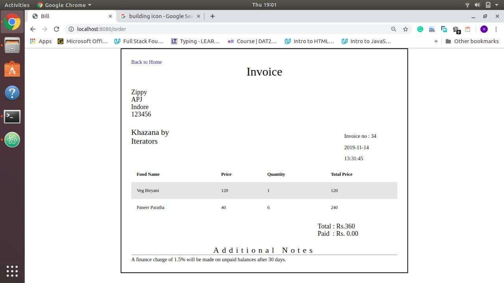

<html><body class="c27">

Indian Institute of Technology, Indore

CS 257

DBIS Project

Restaurant Management (Khazana) Database for IIT Indore

Xomato&nbsp;of IIT Indore

Submitted by- Shaikh Ubaid and Ruchir Mehta

Introduction:

Restaurants are the places where they have to deal with huge databases handling the menu and the order placed by multiple customers simultaneously. We as customers face a lot of problems while choosing a place and food items to dine. We want that we eat our desired food items which also has good rating points and great reviews and would we great if it is among the trending items of that restaurant. To rectify this issue we came up with a platform that will take care of all your needs and provide you with a facility to order food from home after a proper procedure of logging in into your account.

Project Description :

We as students face many problems and even outsiders many times face some difficulties while choosing a restaurant at mealtime on our campus. Out institute offers various degrees viz. BTech, MTech, PhD, MSc and there are different prices for students pursuing different degrees. While choosing a restaurant, we do not know whether it is open or close and even if we know the menu and prices are unknown. Secondly, many items of a restaurant do not become popular since they remain hidden from customers due to unawareness about them among the customers.

A pocket-friendly person wants that he gets his desired food item in his budget which has nice ratings and reviews and is currently a trending item of that restaurant. There are about 10 restaurants which generally makes the customer confused in choosing a particular place to eat. Hence, we came up with an idea to integrate this information about restaurants on our campus which is very useful for all students, faculties, visitors and the shop owner themselves.

For Newcomers and Visitors:

For newcomers, visitors and all the students@ IITI, it will be a great boon which will help them decide. &nbsp;1. What to eat? 

2 . Where to eat? 

3. When to eat?

For shop owners:

&nbsp;They can:

1)Edit the menu anytime:

a)add food items 

b)delete items 

c)modify prices 

2)Change restaurant timing 

a)they can switch their restaurant open/close through a manual process also in our software 3)Manage/maintain a proper information (type/job)about the workers, chef, waiter, etc(their salary, their name, hired date) 

4)Manage the amount of food constituents available in their inventory. Here manage involves the amount present and constituents present. Moreover as soon as the quantity of any item reduces below a pre-set limit, it shows warning and gets added to the shopping list of Due Items.
<ul class="c1 lst-kix_list_11-0 start"><li class="c0 li-bullet-0">We will keep a managerial section in this project which keeps a track of all out clients (shopowners) where the upcoming shop owners can join the system through a login channel for which we maintain a login system.</li><li class="c0 li-bullet-0">Customers will get a bill based on the food items ordered. Bill will be printed. They can order food from one restaurant only.</li></ul>

Restaurants:

&nbsp;ER Analysis: Identifying Entity Sets :
<ol class="c1 lst-kix_list_7-0 start" start="1"><li class="c0 li-bullet-0">Employee(entity set)</li><li class="c0 li-bullet-0">Restaurant(entity set)</li><li class="c0 li-bullet-0">Orders(entity set)</li><li class="c0 li-bullet-0">Order_Details(partial entity)</li><li class="c0 li-bullet-0">Customer(entity set)</li><li class="c0 li-bullet-0">Food(entity set)</li><li class="c9 li-bullet-0">Account(entity set)</li></ol>
Relationship Sets:
<ol class="c1 lst-kix_list_8-0 start" start="1"><li class="c0 li-bullet-0">Menu &ndash; Between Restaurant and Food Item (one to many) </li><li class="c0 li-bullet-0">Controls &ndash; Recursive Relation on Employee Entity Set. A Manager controls its Workers (one to many) </li><li class="c0 li-bullet-0">Works &ndash; Between Employee and Restaurant (many to one) </li><li class="c0 li-bullet-0">Belongs &ndash; Between Bill and Restaurant (many to one) </li><li class="c0 li-bullet-0">Contains &ndash; Between Bill and Food Items (many to many) </li><li class="c0 li-bullet-0">Consists &ndash; Between Order and Order Details (one to many) </li><li class="c0 li-bullet-0">Employee_Login &ndash; Between Manager and Account (one to one) </li><li class="c0 li-bullet-0">Customer_Login &ndash; Between Customer and Account (one to one) </li><li class="c9 li-bullet-0">Paid_By &ndash; Between Bill and Customer (many to one)</li></ol>

Entity and Relationship Sets:

Transformation of ER diagrams into set of Tables:

create database rs;
<ol class="c1 lst-kix_list_1-0 start" start="1"><li class="c9 li-bullet-0">Employee</li></ol>
&nbsp;CREATE TABLE employee (

employee_id INTEGER PRIMARY KEY AUTOINCREMENT,

first_name VARCHAR (255),

last_name VARCHAR (255),

salary INTEGER,

incentive DECIMAL,

contact_no VARCHAR,

hire_date DATE,

experience INTEGER,

manager_id INTEGER

); &nbsp;&nbsp;&nbsp;
<ol class="c1 lst-kix_list_1-0" start="2"><li class="c9 li-bullet-0">Restaurant</li></ol>
CREATE TABLE restaurant (

name VARCHAR (255),

rating DECIMAL,

rating_count INTEGER,

status BOOLEAN,

open_time TIME,

close_open TIME,

contact_no VARCHAR,

trending VARCHAR,

least_ordered VARCHAR,

located_near VARCHAR,

street_name VARCHAR,

rest_id INTEGER PRIMARY KEY AUTOINCREMENT,

city VARCHAR

);

<ol class="c1 lst-kix_list_1-0" start="3"><li class="c9 li-bullet-0">Food</li></ol>
CREATE TABLE food (

name VARCHAR (255),

price INTEGER,

rating INTEGER,

rating_count INTEGER,

food_id INTEGER PRIMARY KEY AUTOINCREMENT

);
<ol class="c1 lst-kix_list_1-0" start="4"><li class="c9 li-bullet-0">Orders</li></ol>
CREATE TABLE Orders (

order_id INTEGER PRIMARY KEY AUTOINCREMENT,

order_date DATE DEFAULT (date(&#39;now&#39;) ),

sum INTEGER,

rest_comment VARCHAR,

rest_rating INTEGER,

order_time TIME DEFAULT (time(&#39;now&#39;) ) 

);

<ol class="c1 lst-kix_list_1-0" start="5"><li class="c9 li-bullet-0">Customers</li></ol>
&nbsp;CREATE TABLE customers (

username VARCHAR PRIMARY KEY,

first_name VARCHAR,

last_name VARCHAR,

phone INTEGER

);

&nbsp;
<ol class="c1 lst-kix_list_1-0" start="6"><li class="c9 li-bullet-0">Menu</li></ol>
CREATE TABLE Menu (

Rest_id INTEGER,

Food_id INTEGER PRIMARY KEY AUTOINCREMENT

);
<ol class="c1 lst-kix_list_1-0" start="7"><li class="c9 li-bullet-0">Works</li></ol>
CREATE TABLE works (

rest_id INTEGER,

employee_id INTEGER PRIMARY KEY AUTOINCREMENT

);
<ol class="c1 lst-kix_list_1-0" start="8"><li class="c9 li-bullet-0">Order_Details</li></ol>
CREATE TABLE Order_Details (

order_id INTEGER REFERENCES Orders (order_id),

food_id INTEGER REFERENCES food (food_id),

food_rating INTEGER,

comments VARCHAR (255),

quantity INTEGER,

amount INTEGER

);
<ol class="c1 lst-kix_list_1-0" start="9"><li class="c0 li-bullet-0">Account</li></ol>
CREATE TABLE account (

username VARCHAR (255),

password VARCHAR (255) 

&nbsp; &nbsp; &nbsp; &nbsp; &nbsp; &nbsp; &nbsp; &nbsp;);

<ol class="c1 lst-kix_list_1-0" start="10"><li class="c0 li-bullet-0">Belongs</li></ol>
CREATE TABLE belongs (

rest_id INTEGER,

order_id INTEGER PRIMARY KEY AUTOINCREMENT

);

<ol class="c1 lst-kix_list_1-0" start="11"><li class="c9 li-bullet-0">Employee_login</li></ol>
CREATE TABLE employee_login (

employee_id INTEGER,

username VARCHAR (255) 

&nbsp; &nbsp; &nbsp; );

<ol class="c1 lst-kix_list_1-0" start="12"><li class="c9 li-bullet-0">Paid_By</li></ol>
CREATE TABLE paid_by (

order_id INTEGER PRIMARY KEY AUTOINCREMENT,

username VARCHAR (255) 

);

Triggers

CREATE TRIGGER cal

AFTER INSERT

ON Order_Details

FOR EACH ROW

BEGIN

UPDATE order_details

SET amount = new.quantity * (

SELECT price

FROM food

WHERE food.food_id = new.food_id

)

WHERE food_id = new.food_id AND 

order_id = new.order_id;

END;

;&nbsp;

SQL Queries (as implemented in code):
<ol class="c1 lst-kix_list_14-0 start" start="1"><li class="c0 li-bullet-0">HomePage:</li></ol>
select * from restaurant;
<ol class="c1 lst-kix_list_14-0" start="2"><li class="c0 li-bullet-0">MenuPage:</li></ol><ul class="c1 lst-kix_list_21-0 start"><li class="c31 li-bullet-0">select * from restaurant;</li></ul><ul class="c1 lst-kix_list_16-0 start"><li class="c35 li-bullet-0">select * from menu inner join food on menu.food_id=food.food_id&nbsp;&nbsp;&nbsp;&nbsp;&nbsp;&nbsp;&nbsp;&nbsp;where menu.rest_id=rest_id;</li><li class="c35 li-bullet-0">SELECT name FROM restaurant WHERE rest_id =rest_id;</li></ul><ol class="c1 lst-kix_list_14-0" start="3"><li class="c0 li-bullet-0">select * from restaurant where name=rest_name;</li><li class="c0 li-bullet-0">select * from food where food_id in (&quot;+food_id+&quot;);</li><li class="c0 li-bullet-0">insert into orders(sum) values(sum);</li><li class="c0 li-bullet-0">SELECT * FROM orders ORDER BY order_id DESC LIMIT 1;</li><li class="c7 li-bullet-0">Insert &nbsp;into belongs(rest_id,order_id) values(restaurant.rest_id,order_detail.order_id);</li><li class="c7 li-bullet-0">insert into paid_by(order_id,username) values(order_detail.order_id,req.session.username);</li><li class="c7 li-bullet-0">for(let index=0;index&lt;food_item.length; index+ +)</li></ol>
&nbsp;{ &nbsp;db.run(&quot;insert into order_details(order_id,food_id,quantity) values(?,?,?)&quot;,[order_detail.order_id,food_item [index].food_id,m.get(food_item[index].food_id)],function(err){}); }
<ol class="c1 lst-kix_list_14-0" start="10"><li class="c7 li-bullet-0">select * from customers where username = req.session.username;</li><li class="c7 li-bullet-0">select * from paid_by inner join orders on paid_by.order_id=orders.order_id inner join belongs on orders.order_id=belongs.order_id inner join restaurant on restaurant.rest_id=belongs.rest_id where username = req.session.username;</li><li class="c7 li-bullet-0">select * from order_details inner join food on food.food_id=order_details.food_id where order_details.order_id=order_id</li><li class="c7 li-bullet-0">SELECT * FROM account WHERE username = username AND password = password;</li><li class="c7 li-bullet-0">insert into account values(username,password)</li><li class="c7 li-bullet-0">&nbsp;insert into customers values(?,?,?,?)&quot;,[username,firstname,lastname,phone]</li><li class="c7 li-bullet-0">select * from customers inner join account on customers.username=account.username where customers.username = ?&quot;,[req.session.username]</li><li class="c7 li-bullet-0">update customers set first_name=?,last_name=?,phone=? where username=?&quot;,[firstname,lastname,phone,username]</li><li class="c7 li-bullet-0">&nbsp;&quot;update account set password=? where username=?&quot;,[password,username]</li></ol>

Implementation Of the Above Database

Web Pages
<ul class="c1 lst-kix_list_15-0 start"><li class="c0 li-bullet-0">Homepage</li></ul>

<ul class="c1 lst-kix_list_15-0"><li class="c0 li-bullet-0">Profile Page</li></ul>

<ul class="c1 lst-kix_list_15-0"><li class="c9 li-bullet-0">Invoice:</li></ul>

<ul class="c1 lst-kix_list_15-0"><li class="c0 li-bullet-0">Contact:</li></ul>

<ul class="c1 lst-kix_list_15-0"><li class="c9 li-bullet-0">Menu:</li></ul>

<ul class="c1 lst-kix_list_15-0"><li class="c0 li-bullet-0">My Orders Page:</li></ul>

--Thank You--

</body></html>
